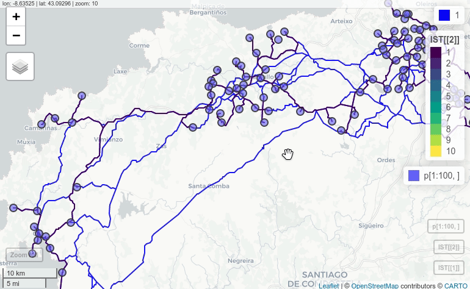

Iterative Steiner Tree
================
2020-05-09

# Description

The goal of IterativeSteinerTree is to perform an Steiner Tree using
grass tools internaly. It has been conceived to calculate Steiner Tree
in large networks without burning out the PC. How does it work? The
algorith iterates over a list of points, creating an Steiner Tree with a
sample of these. After all the iterations, it pastes the different trees
and calculates a global Steiner Tree. This method allows the user to get
rid of never used paths and simplifies the informations the grass
v.net.steiner needs. Morover, the library contains tools to clean
topology error and “undchained” lines that can make grass crush.

# Installation

You can install the released version of IterativeSteinerTree from
[CRAN](https://CRAN.R-project.org) with:

``` r
install.packages("IterativeSteinerTree", dependencies = TRUE)
```

# Examples

## Clean lines to get rid of unchained lines and topology errors:

``` r
library(IterativeSteinerTree)

# basic setGRASS (based on iniGRASS params but simplified)
setGRASS(gisBase = "/usr/lib/grass78", epsg= 25829)
## La región predeterminada fue actualizada a la nueva proyección, pero si
## usted tiene múltiples Directorios de mapas debe correr 'g.region -d' en
## cada uno para actualizar la región a partir de la predeterminada
## Información de la proyección actualizada

# load sldf (l) and spdf (p)
data("l"); data("p")

# clean lines
lclean <- CleanLines(l)
## ADVERTENCIA: El umbral para la herramienta 1 no puede >0, establecido a 0
## Exportando 12846 elementos...
##    5%  11%  17%  23%  29%  35%  41%  47%  53%  59%  65%  71%  77%  83%  89%  95% 100%
## v.out.ogr completo. 13011 elementos (tipo Line String) escritos a <lc>
## (formato GPKG).
## OGR data source with driver: GPKG 
## Source: "/tmp/RtmpsMZevH/grassdata/PERMANENT/.tmp/cesarkero-PC/787.0.gpkg", layer: "lc"
## with 13011 features
## It has 13 fields
```

Large networks use to have little unconections and topology errors that
could result in a failure when calculating Steiner Tree. Here you can
check the differences between clean and dirty lines. Red lines are those
included in the original layer and not in the corrected
one:

``` r
mapview(l, color="red")+lclean
```

<div class="figure" style="text-align: center">


<p class="caption">

Example of removed lines (red)

</p>

</div>

## Calculate Iterative Steiner Tree

This is the core of the library and the only tools that’s needed to
create the Steiner Tree. It can be used both to calculate a non
iterative Steiner Tree (by setting iterations = 0/1) or to calculate an
Iterative Steiner Tree. The main function will return a list of: -
\[\[1\]\] –\> Merged Steiner Tree with all iterations - \[\[2\]\] –\>
Total Steiner Tree calculated using Merged Steiner Trees and points
layer - \[\[3\]\] –\> Total length of the Total Steiner Tree (m) -
\[\[4\]\] –\> Total time of processing in
mins

``` r
IST <- IterativeSteinerTree(l = lclean, p[1:100,], th=1000, iterations = 25,
                            samples = 10, clean = FALSE, rpushbullet=TRUE)
```

In this example, an Iterative Steiner Tree have been calculated for 100
points, making 25 iterations with 10 points each:

``` r
m3 <- mapview(IST[[1]], color="blue")+IST[[2]]+p[1:100,]
## create standalone .html
mapshot(m3, url = paste0(getwd(),'/man/html/m3.html'))
```

<iframe width="75%" height="75%" src="/man/html/m3.html"></iframe>

</iframe>

<div class="figure" style="text-align: center">



<p class="caption">

Example of removed lines (red)

</p>

</div>

Moreover, if you have previously configured
[rpushbullet](https://github.com/eddelbuettel/rpushbullet) you will get
a notification in your devices when the process in
completed.

<div class="figure" style="text-align: center">


<p class="caption">

Example of notification

</p>

</div>

That’s all ¡
