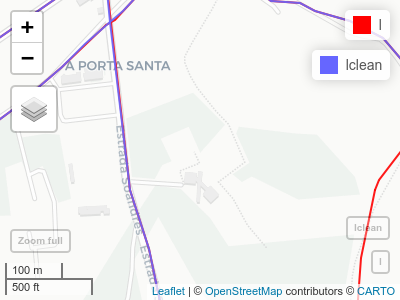
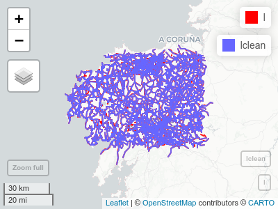

Iterative Steiner Tree
================
2020-05-08

<!-- README.md is generated from README.Rmd. Please edit that file -->

# IterativeSteinerTree

<!-- badges: start -->

<!-- badges: end -->

The goal of IterativeSteinerTree is to perform an Steiner Tree using
grass tools internaly. It has been conceived to calculate Steiner Tree
in large networks without burning out the PC. How does it work? The
algorith iterates over a list of points, creating an Steiner Tree with a
sample of these. After all the iterations, it pastes the different trees
and calculates a global Steiner Tree. This method allows the user to get
rid of never used paths and simplifies the informations the grass
v.net.steiner needs. Morover, the library contains tools to clean
topology error and “undchained” lines that can make grass crush.

## Installation

You can install the released version of IterativeSteinerTree from
[CRAN](https://CRAN.R-project.org) with:

``` r
install.packages("IterativeSteinerTree", dependencies = TRUE)
```

## Examples

### Clean lines to get rid of unchained lines and topology errors:

``` r
library(IterativeSteinerTree)

# basic setGRASS (based on iniGRASS params but simplified)
setGRASS(gisBase = "/usr/lib/grass78", epsg= 25829)

# load sldf (l) and spdf (p)
data("l"); data("p")

# clean lines
lclean <- CleanLines(l)
```

Here you can check the differences between clean and dirty lines:


### Calculate simple Steiner Tree

In this example we are goint to calculate a simple Steiner Tree with a
sample of 50 points, conecting those out of the network by a threshold
of 1000 m

``` r
# calculate Steiner Tree
ST <- SteinerTree(lclean, p[1:50,], th = 1000)
```

### Calculate Iterative Steiner Tree

This is the core of the library and the only tools that’s needed to
create the Steiner Tree. It can be used both to calculate a non
iterative Steiner Tree (by setting iterations = 0/1) or to calculate an
Iterative Steiner Tree. The main function will return a list of:
\[\[1\]\] –\> Merged Steiner Tree with all iterations \[\[2\]\] –\>
Total Steiner Tree calculated using Merged Steiner Trees and points
layer \[\[3\]\] –\> Total length of the Total Steiner Tree (m) \[\[4\]\]
–\> Total time of processing in
mins

``` r
IST <- IterativeSteinerTree(l = lclean, p = p[1:50,], th=1000, iterations = 10,
                            samples = 25, clean = FALSE, rpushbullet=TRUE)
```

Moreover, if you have previously configured
[rpushbullet](https://github.com/eddelbuettel/rpushbullet) you will get
a notification in your devices when the process in completed.


That’s all ¡
